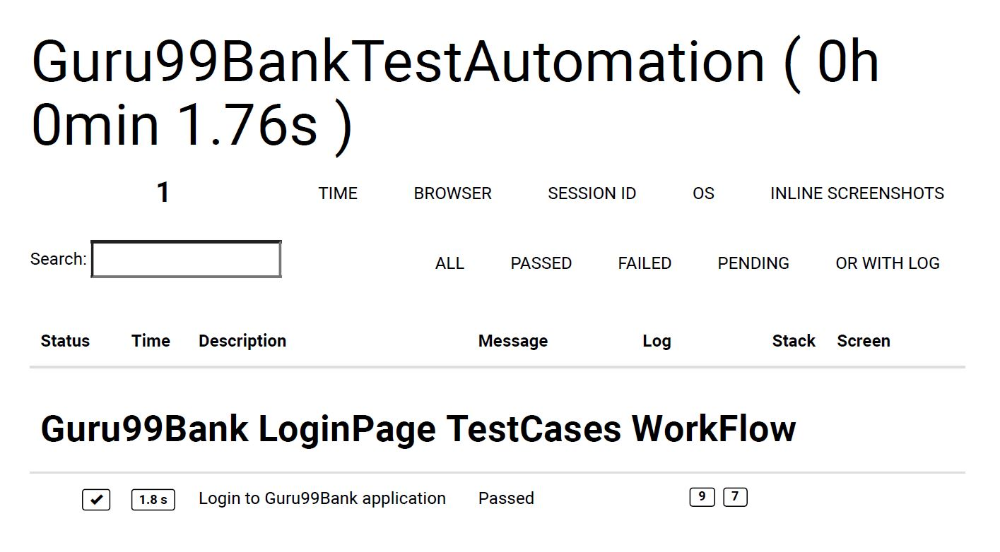

# Pre-requisite to Start Execution:
1. *Java (JDK)*
2. *Nodejs*

# Commands to Execute the TestCases:
1. *npm install ("To install all dependencies").*
2. *npm run webdrivermanager:update("To update or install all executable binaries")*
3. *npm run test("To Start the Executation")*

# Reports will Gererated in:
1. *allure-results("Allure reports will generated")*
2. *TestReports Folder ("Jnuit and Html Reports")*

# TestExecution can simply started by Running:
1. *TestRunner.exe("This Executable will install all dependencies and start executation")*

# To Send TestReports on Email Please set email and password as env varaible .

# TestReport will be generated as

# Project Structure:
1. *Project ("Main Project Folder ")*
2. *Guru99BankTestAutomation ("Name of the Project")*
3. *Config ("This folder contains config.ts configuration file for Protractor")*
4. *Interface ("This folder contains all Interfaces these interfaces are basically guidelines to design fuctions")*
5. *LogManager ("This Folder contains all Logs Related File such as Log configuration and Log Utils")*
6. *OldTestReports ("This Folder contains all old reports all the reports are moved to this folder for every fresh execution")*
7. *Pages ("This Folder Contains two folder")*
	1. **Actions("All the Actions are Kept in this Folder")**
	2. **Locators("All the Locators are Kept in this Folder")**
8. *Suites ("This Folder Contains all Spec file path")*
9. *TestBase ("This Folder Contains the Base File for execution")*
10. *TestCases("This Folder Contains all the Test Cases")*
11. *TestData("This Folder Contains all test data")*
12. *TestReports("This Folder Contains the Fresh Test Reports")*
13. *Utils("This Folder Contains all Utility Functions")*
